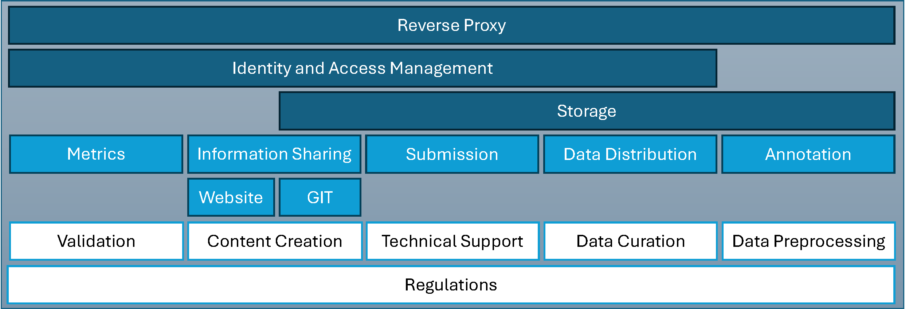

# DIY: Self-Hosted Biomedical Image Analysis Challenge Platform
**Introduction**: Hosting a biomedical image analysis challenge on your own infrastructure offers full control over data and customization of workflows. This guide provides a step-by-step blueprint for setting up a self-hosted challenge platform, from domain setup to automated evaluation. It is written for technically proficient researchers (e.g. PhD students) with little to no DevOps experience. We will cover all essential components – domain and reverse proxy configuration, single sign-on identity management, data storage, annotation tools, code repository and submission handling, as well as a public challenge website.
The [participant workflow](/docs/PARTICIPANT_WORKFLOW.md), the  [automated result evaluation](/docs/EVALUATION.md), and important [security](/docs/SECURITY.md) and [troubleshooting](/docs/TROUBLESHOOTING.md) advice can be found in the linked ReadMe. By following this guide, you can replicate a platform similar to popular challenge hosts (like Grand Challenge or Kaggle) while maintaining independence, compliance, and flexibility.

Overview of the DIY Design. The architecture is divided into three sections:
Dark blue areas represent the infrastructure services, light blue areas indicate challenge services and interfaces, while white areas denote manual organizational tasks. The vertical view provides a comprehensive overview of the utilization of the areas.

**Prerequisites**: You should have access to a server (or VM) where you can run Docker containers, and basic command-line skills. Ensure your server has a modern OS (Linux is ideal) and enough resources (CPU, RAM, storage, and preferably GPU if evaluating deep learning models). A stable internet connection with sufficient bandwidth is important for participants downloading data and submitting results. Familiarity with the Linux command line and text editing will be helpful, but this guide will provide clear instructions for each step.

Let’s start from zero and build up the platform to hero status!

## Domain Registration and NGINX Proxy Manager (Reverse Proxy)
**Register a Domain**: The first step is acquiring a domain name for your challenge platform. Using a
custom domain (e.g. your-challenge.org or a subdomain of your institution) allows clear and
consistent addresses for all services (e.g. login.your-challenge.org ,
git.your-challenge.org ). Choose a domain register and purchase your desired name, then
configure DNS records to point to your server’s IP address. Typically, you’ll add an A record for each
subdomain or a wildcard record to cover all subdomains. Having a proper domain greatly simplifies SSL
certificate management and makes the platform appear professional.

Set Up a Reverse Proxy: Instead of exposing each service directly on different ports, a reverse proxy
will route incoming requests to the correct service based on the URL, and handle TLS/SSL encryption.
This adds a layer of security by shielding backend services from direct Internet access. We
recommend using NGINX Proxy Manager (NPM), which provides a friendly web interface for
managing proxy hosts and SSL certificates. NPM runs as a Docker container and is easy to deploy.

&rarr; [Deploy NGINX Proxy Manager](../services/nginx-proxy/)

## Identity and Access Management with Authentik (Single Sign-On)
For a seamless user experience and secure access control, it’s best to have a Single Sign-On for all your services. Authentik is an open-source Identity and Access Management (IAM) solution that supports OAuth2/OpenID Connect authentication. With Authentik, users register onceand use the same credentials across the platform (website, git, data download, etc.), eliminating the
need for separate logins for each service. Centralized SSO also reduces admin overhead and security risks from password reuse.

&rarr; [Deploy Authentik](../services/authentik/README.md)

## Data Hosting and Distribution (MinIO, Gokapi, SFTP)
Challenges involve large datasets. We need a way to store these files on the server and allow participants to download them securely. Additionally, we may need to accept large result files from participants (if code submission is not used). Our setup uses a combination of MinIO (for object storage) and optionally Gokapi or SFTP for data distribution.

#### MinIO for Object Storage
 We recommend using MinIO as a self-hosted S3-compatible storage solution. MinIO will store the challenge data (e.g. images, annotations, etc.) in a scalable way. It runs well in Docker and can handle large volumes of data efficiently. 

&rarr; [Deploy MinIO](../services/minio/) 

#### Data Distribution to Participants
To securely provide the dataset to participants, you have a couple of options. An easy way is Gokapi – a lightweight self-hosted file sharing tool. Gokapi lets you generate onetime
or limited-access download links via a simple web UI. You can run Gokapi in Docker and use
its web interface to upload the dataset and get a link to share with participants. Authentik can act as an authentication layer (via an embedded outpost) so that participants use. This is useful for one-off transfers: for example, upload your data
file or a zip, then send the participants a link where they can download it in their browser.

&rarr; [Deploy Gokapi](../services/gokapi/)

If you have legal requirements (e.g. users must sign an
agreement), you can implement a registration approval workflow in Authenitk (as we did) before giving them Gokapi access.

Always communicate clearly on the challenge website or email when new data is available.
In summary, MinIO serves as the backend storage for all challenge data , while Gokapi is a frontend for participants to retrieve files securely. This separation ensures you keep control over the master data, and participants only get what they need in a controlled manner.

#### Annotation with CVAT (Ground Truth Labeling)
Before the challenge begins, organizers often need to annotate images to create ground truth for
training and evaluation. High-quality annotations are crucial in biomedical imaging challenges. We
recommend using the Computer Vision Annotation Tool (CVAT) for this task. It is an open-source web application for image and video annotation, supporting
bounding boxes, polygons, keypoints, masks, and more. It allows multiple annotators to work on
projects collaboratively and has an intuitive UI. In medical imaging contexts, CVAT’s efficiency and
flexibility have been demonstrated.

&rarr; [Deploy CVAT](../services/cvat/)

#### After Annotation
Once labeling is done, you will export the annotations from CVAT (it supports
formats like COCO, YOLO, Pascal VOC, etc., or you can get simple CSVs). These serve as your ground
truth for the challenge. Typically, you will split the dataset into:
- Training set: Released to participants
for developing their algorithms (with ground truth labels for training).
- Validation/Test set: Withheld labels (participants might get the images but not the labels, or not get these images at all) for evaluation purposes.

In our challenge, only part of the data was released to participants, and the rest was kept hidden for the
final evaluation.

&rarr; Plan your curation accordingly:
ensure that the test set remains secret to prevent participants from overfitting or peeking at answers.
CVAT is mainly an organizer tool, so you may shut it down once annotation is complete. It doesn’t
necessarily need integration with Authentik unless you want SSO for your annotators’ login (since CVAT
has its own user system). If your annotators are internal or a small group, separate credentials on CVAT
are fine. Just ensure the CVAT instance is not publicly accessible (you can restrict by IP or a simple
password via Nginx Proxy Manager) if you are concerned about security, especially if it contains sensitive images.

## Git-Based Submission and Coordination via Gitea
A critical component of a challenge platform is how participants will submit their results or
algorithms. We use a Git-based approach for transparency and version control, powered by Gitea – a
lightweight, self-hosted Git service. Gitea will also be used for disseminating certain materials
(like starter code, submission templates) and possibly for participant-organizer interactions (issue
tracking or discussions).

&rarr; [Deploy Gitea ](../services/gitea/)

Here are ways Gitea is utilized in the platform: - Information Repository:
- Host a repository (or multiple) with documentation, code examples, or baseline models. For PhaKIR, a
repository containing the submission instructions and template (Dockerfile, data format, evaluation
script examples) was shared via Gitea. Participants could clone this to kickstart their work.
Keeping such resources in git ensures everyone can access the latest version and any updates can be
tracked.
- Submission Repositories: Each team or participant can be given a private repository where they will submit their solution.
There are a couple of models:
    - Result file submission: Participants upload
result files (e.g. segmentation masks, CSV predictions) to their repo. 
    - Algorithm code submission:
Participants push their code or Docker setup which will be run by the organizers.

In our challenge, we opted for algorithm submissions using Docker containers. Each participant
prepared a Docker image (through a provided template) and pushed it to a container registry (Gitea can
serve as a Docker registry). Gitea’s latest versions support a built-in Docker registry for each
repository or a central registry, which can be enabled in the config. The exact method can vary; what’s
important is that Gitea was the hub where participants delivered their submissions, and only organizers (or automated scripts) had access to evaluate those submissions. 
- Permissions and Privacy: Set up
Gitea organizations or teams such that participants cannot see each other’s repositories (to prevent
copying or peeking). For example, create a separate repo for each team and add only that team’s users
with access. Or instruct participants to create a private repository under their account and share it with
the organizers’ account. Using OAuth2 means each participant’s Gitea account is linked to their
Authentik identity, so you can map it easily.
- Issue Tracking & Q&A: You can encourage participants to
use Gitea’s Issues or Discussions to ask technical questions. This keeps a public (or internal) log of Q&A
that all participants can see, contributing to fairness. Alternatively, a forum on the website was used
(discussed later), but Gitea Issues are a viable lightweight solution for support.

Using git has benefits: it’s transparent, you can tag or branch submissions, and you have a history of what was submitted when. It also encourages participants to document their code
(through README files, etc.) as part of submission, which can be useful for challenge proceedings or
verifying methods.
Next, we’ll see how the public-facing website ties in, and then we’ll detail the submission workflow and
evaluation.

## Public-Facing Challenge Portal with WordPress (OAuth Login)
While the backend services (data storage, git, etc.) are in place, participants will primarily interact with
your challenge website for information. A well-designed website is key for disseminating challenge details, rules, and updates. We recommend using WordPress, a popular content management
system, to power the challenge portal. It offers a flexible, user-friendly way to create pages for your challenge (overview, datasets, rules, leaderboards, etc.). It has a vast library of plugins that can extend functionality – for example, forums for discussions, forms for registration, or integration with your SSO. In our case, WordPress significantly improved information accessibility and participant engagement. You don’t need web development from scratch; a simple WordPress site can look professional with minimal effort.

&rarr; [Deploy Wordpress](../services/wordpress/)

Website Content and Plugins:
Build out pages for: 
- Home/Overview: Describe the challenge goals,
timeline, and how to participate. 
- Dataset: Information about the data, perhaps with links to download
(which you’ll add once data is ready). 
- Results/Leaderboard: You might not have this until after
evaluation, but plan a page to display results or winners. If you are interested in a live leaderboard, consider [using MLflow](/services/mlflow/) or similar tools to track and display metrics as embedded website. Read more about this in [automated evaluation](./EVALUATION.md).
- Submission Guidelines: Explain how to submit, link to the Gitea repository template, etc. 
- FAQ/Forum: It helps to have a way for participants to ask questions. We set up a forum on WordPress (using a plugin like bbPress) for participant-organizer interaction. This keeps all Q&A in one place and requires
login (so only participants can post). 
- Registration: If you want to funnel users to register through the site, you can simply provide a link or button that triggers Authentik’s registration flow (e.g., a button that says "Register Now" which goes to Authentik’s sign-up page). 

We did exactly this: the WordPress site had a registration link that sent users to Authentik for self-registration.
Additionally, WordPress plugins were used in our case to help with team management and content
access. For example, a plugin to allow users to form or join teams (if team participation is allowed), and
dynamic content display based on user role (like showing certain menu items only to logged-in users).

**Evaluate your needs**: at minimum, ensure there’s a way to restrict sensitive information (like
download links or forum posts) to only registered participants. OAuth integration will let you treat all
Authentik-authenticated users as a certain role in WordPress (e.g., subscribers).

**Maintaining the Site**: Keep the site updated with announcements. We posted news updates (like data
releases, deadline changes) on the site’s blog section – totaling 18 updates throughout the challenge
– and also emailed these to participants. Consistent communication is key , so plan who will
handle writing updates. WordPress makes it easy to create posts for these announcements.

&rarr; with all components set up (domain/proxy, Authentik, MinIO, Gokapi, CVAT, Gitea, WordPress), let’s walk through how a [participant experiences the platform from start to finish](./PARTICIPANT_WORKFLOW.md)