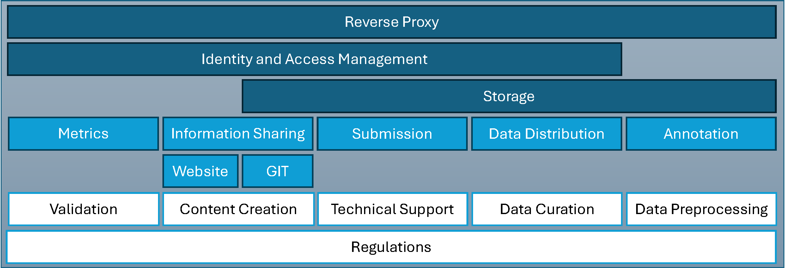

# DIY Design Services Overview

If you are new here, start at the [DIY Readme](../docs/DIY.md).

In this directory, you will find the services that are used in the infrastructure. The services are divided into different directories, each containing a `README.md` file with detailed information about the service, its setup, and its role in the overall architecture.

The docker-compose.yml in this directory is used to start all the services in the infrastructure. It is recommended to begin with each service step by step. 

## Network Overview
The very internal network of each project is called `app-tier`. It is for local communication, e.g. between database and frontend application.

For interconnecting all services, we use a dedicated internal Docker network called `proxy-net`. This network is not exposed to the outside world, ensuring that only the necessary services are accessible externally.

Through the usage of domain names like `auth.example.org`, `gitea.example.org`, `cvat.example.org`, etc., all services are accessible via HTTPS. The NPM handles the SSL termination and routing to the appropriate internal service based on the requested domain.

## System Overview
The following diagram provides an overview of the DIY Design architecture.
